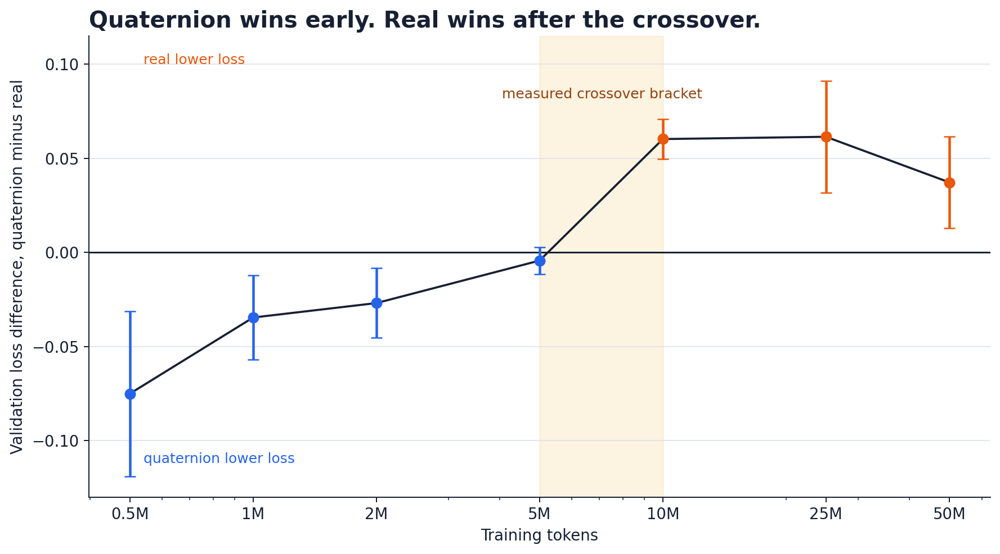

# Quaternion small language-model comparison

This is a compact Karpathy-style decoder experiment where only the Transformer projections change. The real,
complex, and quaternion models otherwise use the same data, batches, optimizer, schedule, attention, and head.

Phase 2 measured a data-dependent crossover. Quaternion projections had lower validation loss through 2M
training tokens, 5M was inconclusive, and real projections won from 10M through 50M.



## Articles

- [Why I ran this test](articles/quaternion-transformers-preface.md)
- [Quaternion Transformers win early, then lose](articles/quaternion-transformers-crossover.md)
- [Short LinkedIn post](articles/linkedin-post.md)

```bash
source .venv/bin/activate
python -m unittest qllm.tests.test_layers
python -m qllm.compare                    # quick pipeline test
python -m qllm.compare --token-budget 50000000  # minimum evidence run (slow)
```

The quick command compares a normal model with quaternion models at (1) equal width and (2) equal total
parameter count, then writes an honest table and plots to `qllm/report/`. It is deliberately labeled a smoke
test because a few thousand tokens and one seed cannot establish the hypothesis.

Full-size YAML configurations are in `qllm/experiments/configs/`; run one with:

```bash
python -m qllm.data.prepare --vocab-size 8192 --train-mb 64 --val-mb 8
python -m qllm.train qllm/experiments/configs/real-base.yaml
```

Run the fixed-budget, three-seed equal-parameter follow-up overnight with:

```bash
./run_overnight.sh
```

It trains only the two arms needed to answer the main hypothesis (300M total tokens), skips completed runs when
relaunched with the same output directory, and writes `manifest.json`, per-run results, `summary.json`, and
`summary.md` under `qllm/runs/overnight-50m/`.

## Phase 2 (`qbench`)

Phase 1 commands and caches above remain unchanged. Phase 2 byte-copies the pinned Phase-1 tokenizer,
training binary, and training text, then encodes a separate 8 MiB validation prefix with that tokenizer:

```bash
python -m qbench.data
python -m unittest tests.test_models
python -m qbench.verify --device auto                 # strict 2x200-step Stage A
python -m qbench.benchmark                         # 50 warmups, 200 iterations
python -m qbench.run --model real --tokens 500000 --seed 1
python -m qbench.analysis.analyze
python -m qbench.generate                             # after final 50M checkpoints exist
python -m qbench.run_crossover                     # full 635M-token sweep; long
python -m qbench.run_ablations
```

`qbench/all.sh` prepares data, runs Phase-1/layer/model tests and strict real-data verification, benchmarks, runs
the crossover and ablations, generates samples, then builds the report. Do not invoke it merely as a quick test.
Runs use source/data/config digests and atomic resumable 5%-boundary checkpoints. Every final metric uses exactly
2M fixed sequential validation tokens at batch 64; every curve point uses the same preregistered 131,072-token
prefix. Generated caches, results, checkpoints, and plots are ignored, while
`qbench/benchmarks/throughput.csv` and `qbench/REPORT.md` are intended deliverables. The Stage-D width-100 real
control is deliberately omitted because introducing low-rank projections would not be a clean algebra-only control.
