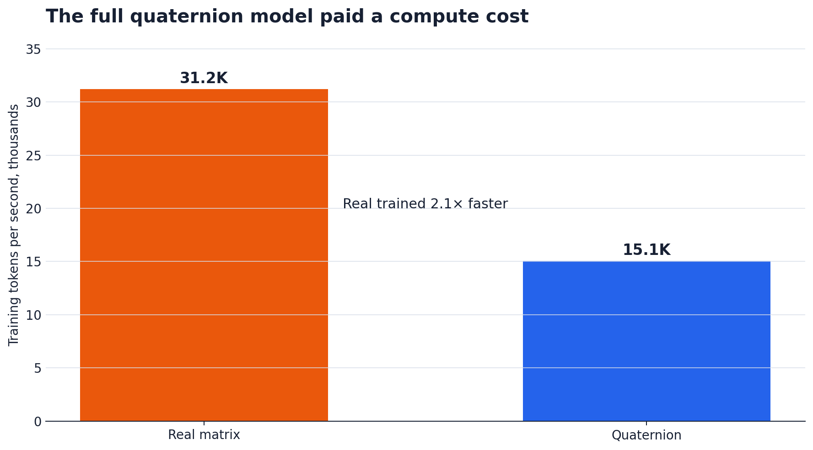
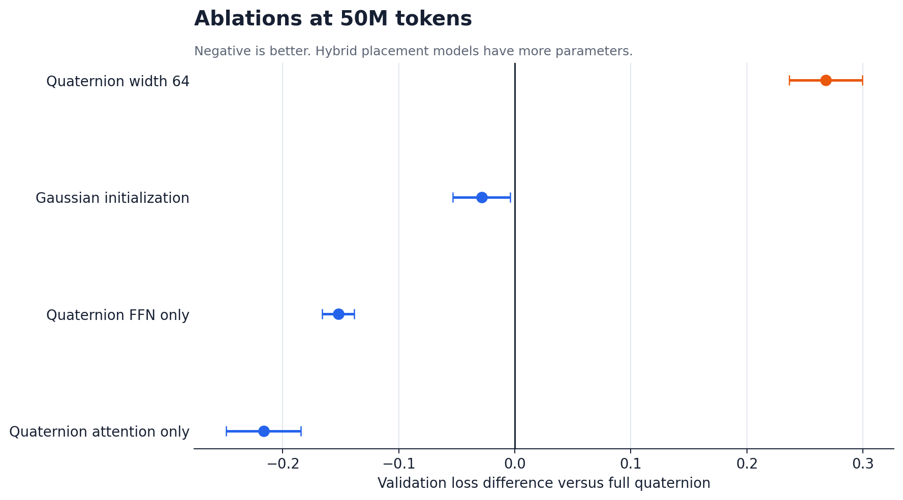

# Quaternion Transformers win early, then lose

A small pilot suggested that quaternion projections could improve a language model at roughly equal parameter count. A longer test produced the opposite result. Phase 2 was designed to find out whether the first result was noise or whether the advantage disappeared as training continued.

It disappeared. Not immediately.

## The claim and the test

The preregistered hypothesis was narrow: quaternion structure acts as an inductive bias in the data-limited regime, then becomes a constraint in the data-rich regime. If that was true, quaternion validation loss should be lower at one or more small token budgets and higher at 50M tokens.

The primary comparison used two decoder-only Transformers:

| Model | Width | Parameters |
| --- | ---: | ---: |
| Real projections | 64 | 168,576 |
| Quaternion projections | 100 | 169,800 |

The parameter difference was 0.73 percent. Both models had two layers, four attention heads, a context length of 64, and a 1,024-token vocabulary. They used the same TinyStories tokenizer, training binary, batches, AdamW settings, cosine schedule, and paired data order.

The sweep covered 0.5M, 1M, 2M, 5M, 10M, 25M, and 50M training tokens. Budgets through 10M used five paired seeds. The 25M and 50M points used three. Final loss was measured on the same sequential 2M-token validation prefix, not on randomly sampled validation batches.

The crossover sweep contained 62 runs. Placement, width, and initialization ablations added 24 more. Total training volume was 1.247 billion tokens.

## The crossover

The reported difference is quaternion loss minus real loss. Negative values favor quaternion. Positive values favor real.

| Training tokens | Seeds | Mean loss difference | 95% CI | Result |
| ---: | ---: | ---: | ---: | --- |
| 0.5M | 5 | -0.0751 | [-0.1190, -0.0312] | Quaternion |
| 1M | 5 | -0.0346 | [-0.0571, -0.0121] | Quaternion |
| 2M | 5 | -0.0270 | [-0.0454, -0.0085] | Quaternion |
| 5M | 5 | -0.0044 | [-0.0116, 0.0029] | Inconclusive |
| 10M | 5 | +0.0602 | [+0.0497, +0.0707] | Real |
| 25M | 3 | +0.0614 | [+0.0317, +0.0911] | Real |
| 50M | 3 | +0.0372 | [+0.0127, +0.0616] | Real |

Every paired seed favored quaternion at 0.5M, 1M, and 2M. At 10M, 25M, and 50M, every seed favored real. The 5M point split by seed and its confidence interval crossed zero.

The experiment therefore locates the crossover between 5M and 10M tokens. That is a bracket, not an interpolated estimate. The preregistered decision rule marked the hypothesis as supported.

_Points show the paired mean. Error bars are 95% Student t confidence intervals._

At 50M tokens, mean validation loss was 2.7047 for real and 2.7419 for quaternion. Mean perplexity was 14.95 and 15.52 respectively. The effect is not huge, but it repeated in all three seeds and the paired confidence interval excluded zero.

## Speed still matters

The quaternion layer originally computed Hamilton products component by component. Replacing that path with one fused real block matrix made the isolated quaternion projection 3.17 times faster than the naive implementation.

That did not make the full models equally fast. Across the training sweep, the real model usually processed about 31,000 tokens per second. The equal-parameter quaternion model processed about 15,000. Part of this comes from the wider quaternion architecture, width 100 instead of 64, and part comes from backend behavior on Apple MPS.

For this experiment, quaternion bought lower loss early at roughly twice the training time. That trade is hard to defend unless training data, rather than compute, is the binding limit.

## What the ablations say

The width-64 quaternion model was much worse than the width-100 quaternion model at both tested budgets. At 50M tokens its loss was higher by 0.2679. It had only 94,848 parameters, so this is not a clean width-only comparison. It does show that the extra width was doing real work. Quaternion parameter sharing did not compensate for removing it.

Initialization produced a cleaner comparison because the parameter count stayed fixed. Independent Gaussian component initialization beat the Parcollet-style quaternion initialization at both 1M and 50M. At 50M the mean loss reduction was 0.0286, with a 95% confidence interval from 0.0037 to 0.0535. Bad Gaussian initialization did not explain the late quaternion loss. In this setup, it was better.

The placement experiments put quaternion projections in attention only or the feed-forward network only. Both hybrid models beat the all-quaternion model at 50M. Attention-only improved loss by 0.2165, and FFN-only by 0.1521. These models also had more parameters, 289,800 and 229,800, so the numbers cannot isolate placement from capacity. They are leads for the next experiment, not a clean causal answer.

## What I would claim now

Quaternion projections are not a general replacement for real-valued matrices in language models. In this model and dataset, they imposed a useful bias during the first few million tokens. After the 5M to 10M region, the same structure limited the final fit.

The result also explains why short pilots are dangerous here. A test stopped at 1M tokens says quaternion wins. A test run only at 50M says it loses. Both observations are correct, but neither describes the training curve.

The next useful test is not another sweep at the same size. It is a larger model near the observed tokens-per-parameter crossover, plus a domain where four-component structure has a reason to exist. Language embeddings do not naturally arrive as quaternions. Rotation, pose, IMU, molecular conformation, and some signal data do.

## Reproduction and scope

The harness records a source digest, dataset hash, model configuration, seed, curves, checkpoints, final metrics, and wall time for each run. Completed runs are idempotent and resumable. The final tables are generated from CSV and per-run metadata.

The result applies to TinyStories, this small architecture, this tokenizer, and Apple MPS. Generation samples from both 50M-token models remain rough, as expected at this scale. They are a sanity check, not a second metric.

Repository files:

* [`quaternion_phase2_protocol.md`](../quaternion_phase2_protocol.md), preregistered protocol
* [`qbench/REPORT.md`](../qbench/REPORT.md), generated report and samples
* [`qbench/run.py`](../qbench/run.py), run harness and result schema
* [`qbench/analysis/analyze.py`](../qbench/analysis/analyze.py), paired analysis and report generator
* [`qbench/benchmarks/throughput.csv`](../qbench/benchmarks/throughput.csv), fused and naive layer benchmark
